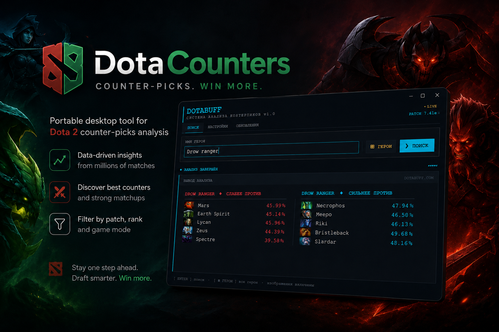
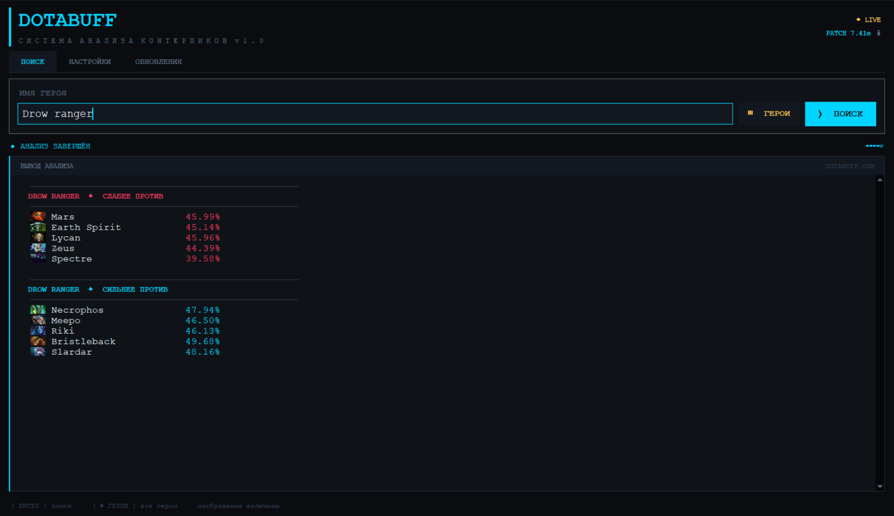
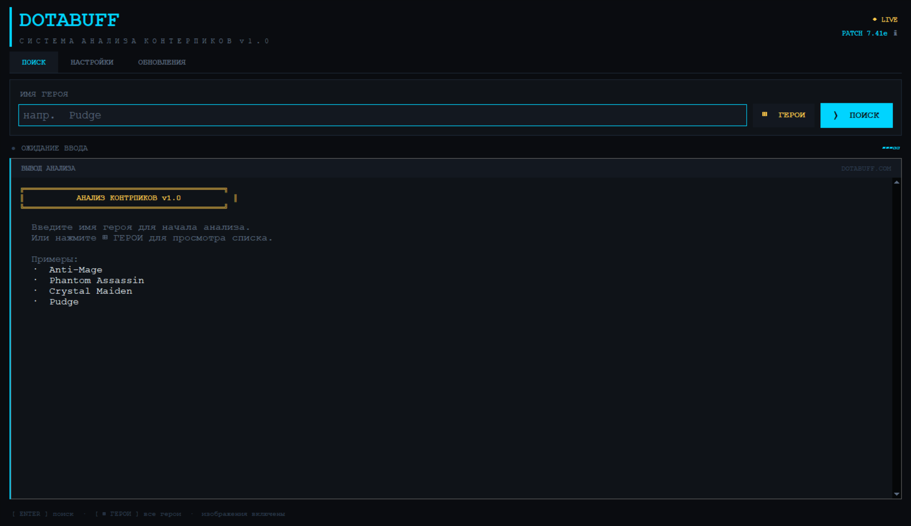
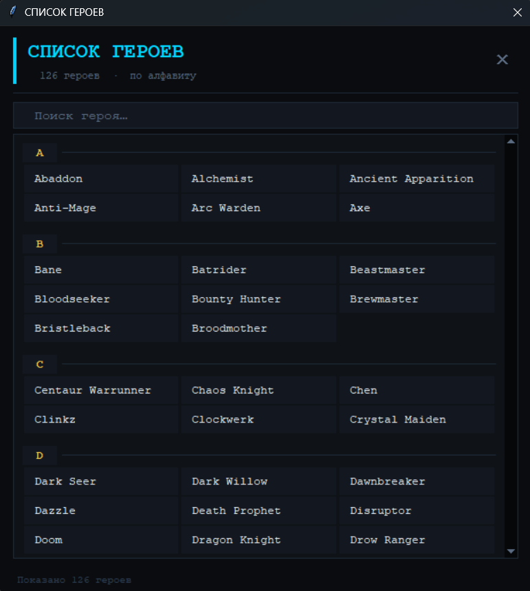
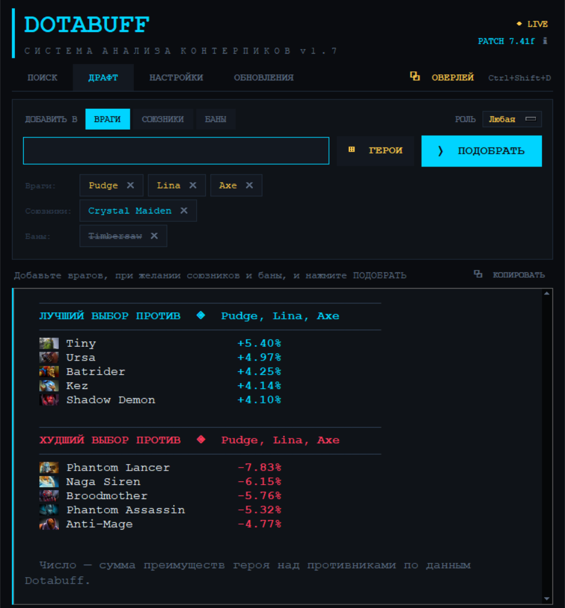
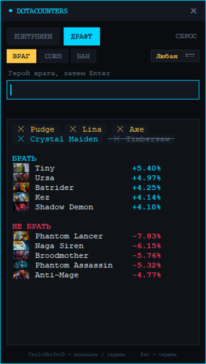

# DotaCounters

**Портативный десктопный инструмент для анализа контрпиков в Dota 2.**


Вводите имя героя — программа подтягивает свежую статистику матчапов с Dotabuff
и показывает, против кого он играет плохо, а против кого хорошо, с иконками
героев и винрейтами. Одно окно, никакой установки, никакого браузера.

---

## Как выглядит

Контрпики Drow Ranger — против кого играет слабее и сильнее, с иконками
и винрейтами:



Стартовый экран. Текущий патч определяется автоматически при запуске:



Встроенный список героев с живым поиском — чтобы не набирать имя руками:



Драфт: враги, союзники и баны; программа складывает матчапы врагов и
показывает, кого брать и кого не стоит. Забаненный Timbersaw из подсказок
исчез:



Оверлей поверх игры — тот же драфт в узком окне, по `Ctrl+Shift+D`:



---

## Возможности

- **Поиск контрпиков** — таблицы «плохо против» и «хорошо против» с винрейтами
  и иконками героев, данные берутся с Dotabuff в реальном времени.
- **Режим драфта** — добавьте до 5 героев противника, и программа сложит их
  матчапы и покажет, кого брать, а кого не стоит. Союзники и баны выпадают
  из подсказок, а фильтр по роли (керри, саппорт, инициатор и другие, по
  разметке Valve) оставляет только нужных. Страницы врагов загружаются сразу
  при добавлении.
- **Оверлей поверх игры** — узкое окно с поиском контрпиков и драфтом.
  `Ctrl+Shift+D` показывает его и ставит курсор в поле ввода, даже когда
  активна игра; повторное нажатие или `Esc` прячет. Состав драфта общий с
  вкладкой «Драфт»: враги, союзники и баны добавляются по мере пиков, и
  подбор пересчитывается сразу. Клавишу можно выбрать в настройках.
  Работает, когда Dota запущена в окне или в окне без рамки; поверх
  полноэкранного исключительного режима Windows чужие окна не показывает.
- **Сколько показывать** — от 1 до 12 строк в каждом разделе, поле «КОЛ-ВО»
  рядом с вводом. Выбор запоминается.
- **Подсказки при вводе** — список подходящих героев под полем; стрелки
  выбирают, Enter ищет. Дефисы и апострофы можно не набирать, а имя можно
  писать по-русски: «пудж» находит Pudge. Понимаются и прозвища: «sf»,
  «бара», «шейкер», «войд», «карл».
- **Избранное и недавние** — под полем поиска, щелчок повторяет поиск.
- **Копировать результат** — кнопка кладёт вывод в буфер обмена текстом.
- **Список героев** — встроенный браузер всех 127 героев с живым поиском,
  чтобы не набирать имя вручную.
- **Патчноуты** — просмотр заметок к текущему патчу Dota 2 прямо в программе,
  с поиском по разделам. Данные из официального datafeed Valve, текст приходит
  на языке интерфейса. Показываются изменения героев и способностей, таланты,
  предметы и нейтральные крипы, пояснения и пометки новых предметов; рядом —
  иконки героев, предметов, способностей, характеристик, талантов и Аганима.
  Имена героев и предметов Valve не переводит ни на одном языке — так же, как
  и в самой игре.
- **Текущий патч** — версия определяется автоматически при запуске.
- **5 цветовых тем** — Cyber Dark, Blood Red, Matrix Green, Ancient Gold,
  Ghost White.
- **Два языка интерфейса** — русский и английский, переключаются на лету.
- **Настройки сохраняются** между запусками.
- **Обновления** — программа раз в сутки проверяет релизы на GitHub и
  показывает плашку, когда вышла новая версия. Кнопка «Обновить» скачивает
  сборку, сверяет контрольную сумму, заменяет файл и перезапускается. Есть
  и ручная проверка на вкладке «Обновления».

---

## Установка

Скачайте `DotaCounters.exe` из раздела
[Releases](https://github.com/silence-creator/DotaCounters/releases)
и запустите. Python и зависимости не нужны — всё внутри.

> Windows SmartScreen может предупредить о неизвестном издателе: сборка не
> подписана сертификатом. «Подробнее» → «Выполнить в любом случае».

---

## Запуск из исходников

Нужен Python 3.10 или новее.

```bash
git clone https://github.com/silence-creator/DotaCounters.git
cd DotaCounters
pip install -r requirements.txt
python main.py
```

`tkinter` входит в стандартную поставку Python для Windows. В Linux его
обычно нужно доставить отдельно (`sudo apt install python3-tk`).

### Тесты

```bash
python -m unittest discover -s tests -v
```

Разбор страницы Dotabuff и ответа с изменениями патча проверяется на
сохранённых копиях настоящих данных (`tests/fixtures/`), поэтому тесты
не ходят в сеть.

---

## Структура

```
main.py                 запуск окна и больше ничего
dotacounters/
    version.py          единственное место с номером версии
    config.py           тема и язык между запусками
    themes.py           цветовые схемы
    i18n.py             строки интерфейса, ru/en
    heroes.py           список героев, прозвища, подбор подсказок
    roles.py            роли героев по разметке Valve (собирается скриптом)
    net.py              общий HTTP-клиент (curl_cffi)
    dotabuff.py         разбор таблиц контрпиков
    draft.py            подбор пика против вражеского состава
    patches.py          патч и патчноуты из datafeed Valve
    icons.py            загрузка иконок, простая отрисовка SVG
    updates.py          проверка и установка обновлений с GitHub
    relaunch.py         перезапуск после обновления с чистым окружением
    recent.py           избранное, недавние герои, геометрия окна
    hotkey.py           глобальная горячая клавиша оверлея
    ui/
        app.py          главное окно
        overlay.py      оверлей поверх игры
        role_menu.py    выпадающий список ролей
        hero_browser.py список героев
        suggestions.py  подсказки при вводе имени
        patch_notes.py  заметки к патчу
        winapi.py       тёмный заголовок и активация окна в Windows
tools/
    update_roles.py     пересобрать roles.py из datafeed Valve
```

Версия указана один раз, в `dotacounters/version.py`. Оттуда её берут все
надписи в интерфейсе — править больше нигде не нужно. Имя `.exe` версии не
содержит: обновление ставит новый файл на место старого.

---

## Сборка .exe

```bash
python -m pip install pyinstaller
python -m PyInstaller main.spec
```

Готовый файл появится в `dist/`. Спека собирает всё в один исполняемый файл
без консольного окна, с иконкой из `icon.png`.

> Команды намеренно начинаются с `python -m`. Если в системе несколько версий
> Python, `pyinstaller` из PATH может принадлежать другой из них, и сборка
> получится на её библиотеках. Так вышло с первой сборкой 1.4: она собралась
> на Python 3.14 и не запускалась там, где Windows старее, чем требует 3.14.
> Версия Python в сборке видна по имени `pythonXYZ.dll` внутри `.exe`.

---

## Как это работает

| Что | Источник | Механика |
|-----|----------|----------|
| Контрпики | `dotabuff.com/heroes/{герой}/counters` | Имя героя превращается в slug, страница забирается через `curl_cffi` с отпечатком Chrome (обход Cloudflare). Разделы опознаются по заголовкам над таблицами, колонки — по подписям, а не по номерам |
| Драфт | по странице на каждого врага | Для каждого врага берётся его полная таблица матчапов; преимущества кандидатов складываются по всем врагам. Союзники и баны из кандидатов исключаются. Все запросы идут одной сессией — серия новых соединений упирается в защиту Dotabuff |
| Роли героев | `dota2.com/datafeed/herodata`, поле `role_levels` | Разметка Valve: уровень 0–3 для каждой роли. Меняется редко, поэтому не качается при запуске, а лежит в `roles.py`; обновляется скриптом `tools/update_roles.py` |
| Больше 5 строк | та же страница, таблица «Matchups» | Короткие таблицы Dotabuff содержат ровно 5 строк, поэтому при большем значении разделы берутся с начала и конца полной таблицы, отсортированной по преимуществу |
| Иконки героев | `dotabuff.com` | Догружаются отдельными запросами и кладутся в кеш рядом с программой: повторный поиск берёт их с диска |
| Текущий патч | `dota2.com/datafeed/patchnoteslist` | Официальный datafeed Valve; при недоступности — запасной вариант через Dotabuff |
| Патчноуты | `dota2.com/datafeed/patchnotes` | Внутренний ключ версии сначала резолвится по списку патчей |
| Иконки в патчноутах | CDN Valve, справочники `herolist` / `itemlist` / `abilitylist` | Внутренние имена из справочников превращаются в адреса картинок; качаются параллельно после показа текста |
| Обновления | `api.github.com/.../releases/latest` | Версия сравнивается с текущей; файл скачивается и сверяется по контрольной сумме из ответа GitHub. Работающий `.exe` переименовывается в `.old`, новый встаёт на его место, программа перезапускается |

Сетевые запросы идут в фоновом потоке, интерфейс не блокируется.

---

## Конфигурация

Настройки, избранное, недавние герои и размер окна хранятся в `dota_config.json`
рядом с программой, скачанные иконки — в папке `cache` там же. Файл создаётся
при первом сохранении настроек; удалите его, чтобы сбросить всё к значениям
по умолчанию.

```json
{
  "theme": "cyber",
  "lang": "ru",
  "limit": 5,
  "last_update_check": "2026-09-23",
  "history": ["Pudge"],
  "favourites": ["Lina"],
  "window": "760x860+100+40",
  "overlay_hotkey": "ctrl+shift+d",
  "overlay_pos": "+1540+120"
}
```

Клавишу оверлея проще выбрать в настройках. В `overlay_hotkey` можно вписать
и свою: модификаторы `ctrl`, `alt`, `shift`, `win` и буква, цифра,
`f1`–`f24` или `space`. Если комбинацию уже
заняла другая программа, рядом с кнопкой «ОВЕРЛЕЙ» появится красная пометка —
тогда оверлей открывается кнопкой.

---

## Оговорки

- Программа получает данные с **Dotabuff** — неофициального стороннего сайта.
  Если Dotabuff изменит вёрстку страниц или ужесточит защиту, разбор данных
  может перестать работать до выхода обновления.
- Проект **не связан с Valve Corporation и не поддерживается ею**. Dota 2 —
  торговая марка Valve Corporation.
- Пользуйтесь разумно: не гоняйте запросы пачками, уважайте чужие серверы.

---

## Лицензия

[MIT](LICENSE) © 2026 Kirill Zaleskiy
