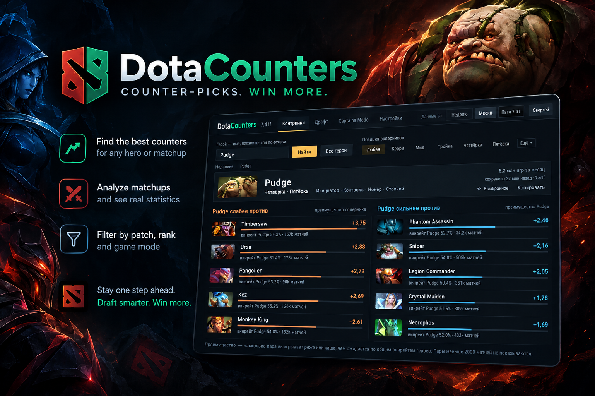
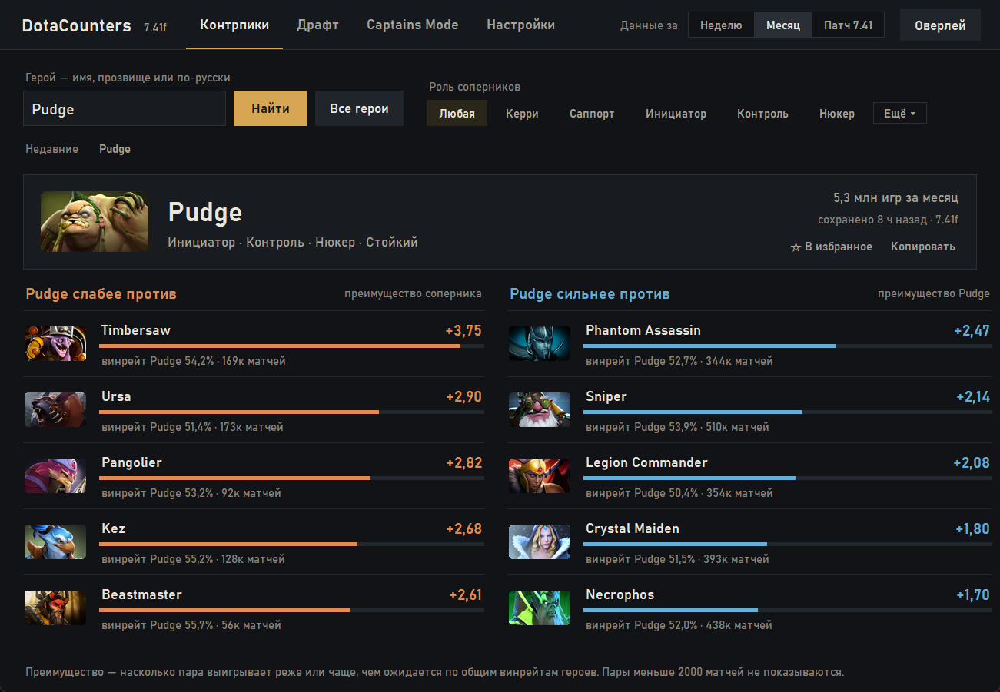
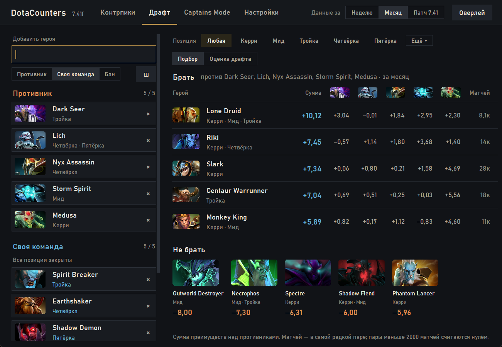
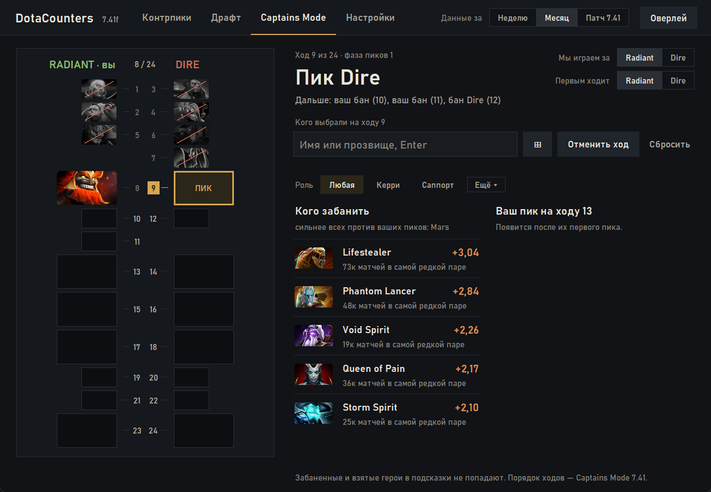
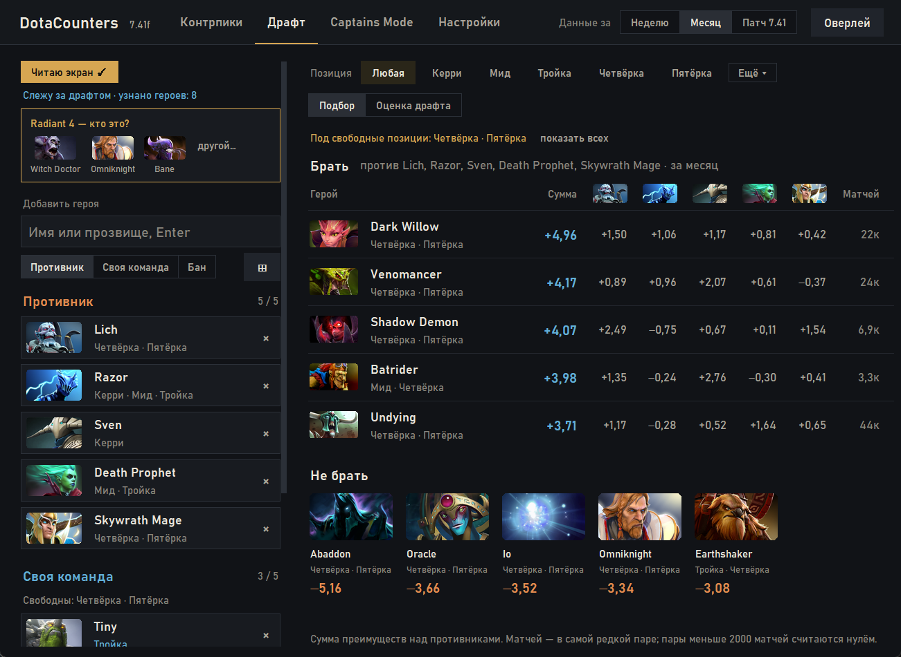
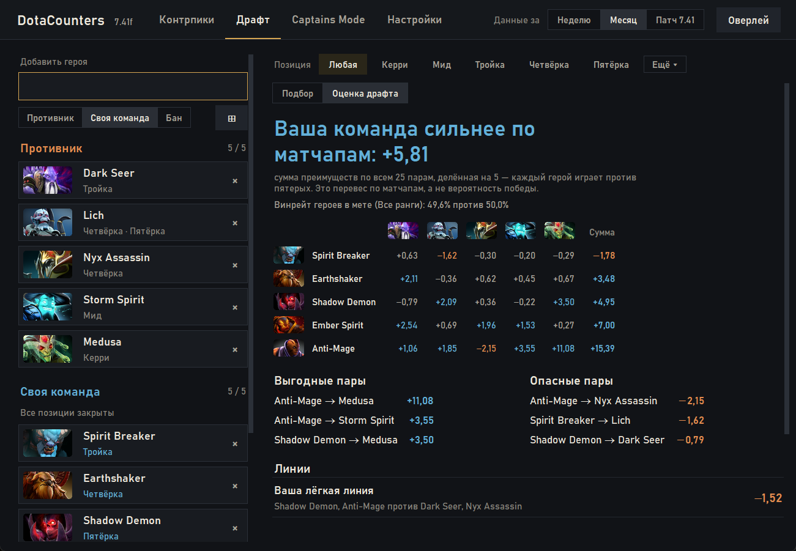
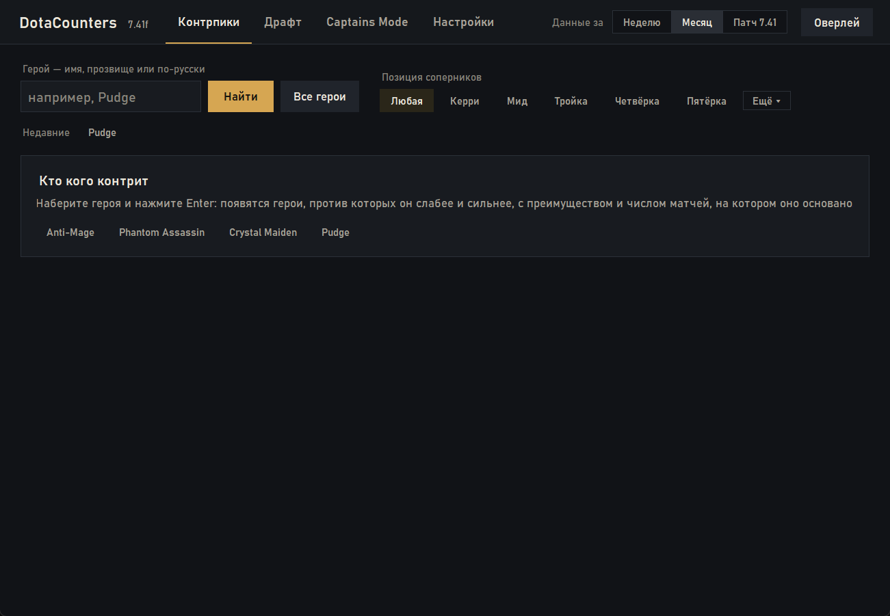
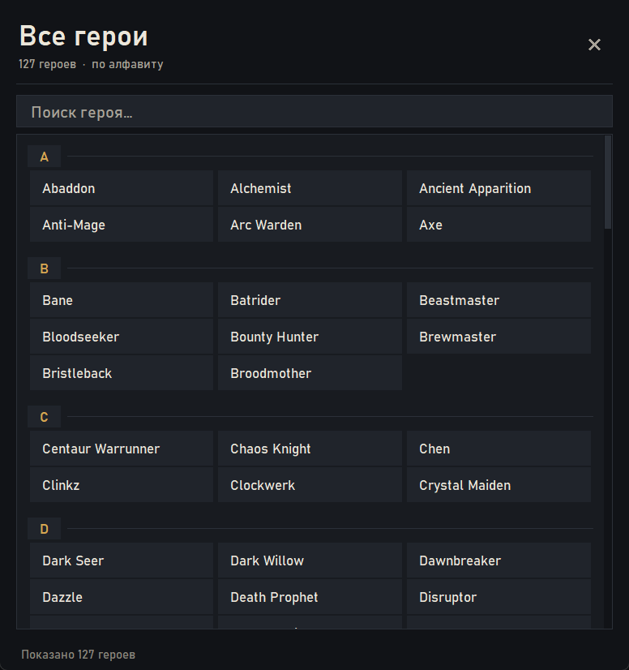
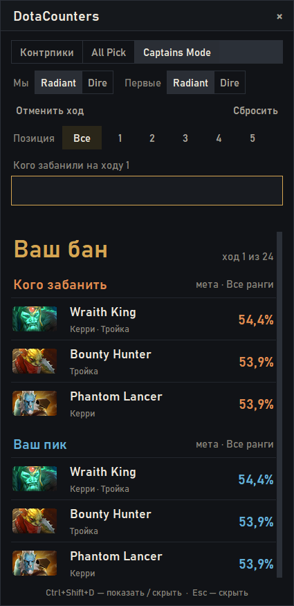

# DotaCounters

**Портативный десктопный инструмент для контрпиков и драфта в Dota 2.**


[](https://github.com/silence-creator/DotaCounters/actions/workflows/tests.yml)


Вводите имя героя — программа подтягивает свежую статистику матчапов с Dotabuff
и показывает, против кого он играет слабее, а против кого сильнее: с портретами
героев, преимуществом и числом матчей, на котором оно основано. Драфт All Pick
и Captains Mode подсказывают, кого брать и кого банить, а героев программа может
прочитать прямо с экрана игры. Одно окно, никакой установки, никакого браузера.

---

## Как выглядит

Контрпики Pudge: главное число — преимущество, полоса показывает его величину,
серым — винрейт и число матчей в паре:



Драфт: противник, своя команда и баны слева, справа — кого брать, с колонкой
на каждого врага, и кого брать не стоит:



Captains Mode: все 24 хода по порядку, как в игре. Программа знает, чей ход,
и подсказывает, кого банить против ваших пиков и кого брать против их пиков:



Чтение с экрана: программа сама узнала героев на экране драфта Dota и разложила
их по командам. В клетке, где она не уверена, — вопрос и три кандидата:



Оценка драфта: какая команда сильнее по матчапам, каждый герой против каждого,
выгодные и опасные пары, линии:



Стартовый экран и встроенный список героев:





Оверлей поверх игры — поиск и оба драфта в узком окне, по `Ctrl+Shift+D`.
На снимке — начало Captains Mode: баны и пики по мете, сторона и первый ход:



---

## Возможности

- **Контрпики** — против кого герой слабее и сильнее. Главное число —
  преимущество: насколько пара выигрывает чаще или реже, чем ожидается по
  общим винрейтам героев. Под именем — винрейт и число матчей. Фильтр по
  позиции отвечает на вопросы вроде «какой мидер сильнее против Pudge».
- **Позиции 1–5** — Керри, Мид, Тройка, Четвёрка, Пятёрка. У Valve позиций
  нет, только роли, поэтому они выводятся из статистики линий Dotabuff: доли
  матчей героя на каждой линии и золота, которое он там зарабатывает. Герой
  попадает в позицию от 20% матчей, у многих их две. Роли Valve (инициатор,
  нюкер и другие) — в меню «Ещё». Позиции подписаны под именами героев в
  подсказках, в составе драфта и в оверлее. Выбранный фильтр запоминается.
- **Под свободные позиции** — в драфте и Captains Mode программа расставляет
  ваших героев по позициям и подсказывает пики только на свободные: взяли
  тройку и пятёрку — в подсказках керри, мидеры и четвёрки. «Показать всех»
  выключает это; выбранная вручную позиция — тоже.
- **Драфт All Pick** — добавьте до 5 героев противника, и программа сложит их
  матчапы: кого брать (с разбивкой по каждому врагу) и кого не стоит. Своя
  команда (до пятерых, вместе с вашим героем) и баны выпадают из подсказок,
  фильтр по позиции оставляет нужных.
- **Captains Mode** — полный порядок из 24 банов и пиков. Вводите героев по
  очереди: программа показывает, чей ход и что дальше, предлагает баны против
  ваших пиков и пики против их пиков. «Мы играем за» и «Первым ходит»
  переключаются, ход можно отменить.
- **Баны в Captains Mode** — в первой фазе, до любых пиков, по мете: сильнейшие
  по винрейту среди героев, которых берут хотя бы в 5% игр, для выбранного
  ранга (до 2K … Divine+). После пиков — против ваших героев и под позиции,
  которых не хватает противнику: керри банить незачем, если он у них уже есть.
  Пока противник никого не взял, пики тоже подсказываются по мете.
- **Чтение драфта с экрана** — выключатель «Читать с экрана» в Драфте,
  Captains Mode и оверлее. Раз в секунду программа смотрит в окно Dota и
  узнаёт героев по портретам: в All Pick — по верхней полосе (свою команду
  отличает по вашему имени), в Captains Mode — по доске, вместе с банами,
  первым ходом и вашей стороной. Неуверенного героя программа не подставляет,
  а спрашивает: три кандидата на один щелчок; подтверждённую клетку она
  запоминает. Нужен режим «В окне» или «В окне без рамки».
- **Оценка драфта** — рядом с подсказками в Драфте и Captains Mode: какая
  команда сильнее по матчапам и насколько, таблица «каждый против каждого»,
  выгодные и опасные пары, линии по позициям и винрейт героев в мете.
- **Период** — данные за неделю, месяц или весь патч, переключатель в шапке.
  За патч матчей впятеро больше — цифры стабильнее; неделя показывает свежие
  правки баланса.
- **Без случайных цифр** — пары, сыгранные меньше 2000 раз, в списки не
  попадают, а в драфте считаются нулём: у них цифра — в основном шум.
- **Оверлей поверх игры** — узкое окно с контрпиками, All Pick и Captains Mode.
  `Ctrl+Shift+D` показывает его и ставит курсор в поле ввода, даже когда
  активна игра; повторное нажатие или `Esc` прячет. Драфты общие с вкладками,
  позицию (Все, 1–5) можно выбрать прямо в оверлее. В Captains Mode оверлей
  показывает и кого банить, и кого брать, а сторону и первый ход можно
  переключить в нём же.
  Клавишу можно выбрать в настройках. Работает, когда Dota запущена в окне или
  в окне без рамки; поверх полноэкранного исключительного режима Windows чужие
  окна не показывает.
- **Кеш страниц** — страница героя хранится сутки в папке `cache\pages`,
  повторный поиск и драфт работают мгновенно. После нового патча страницы
  загружаются заново; очистить можно в настройках.
- **Подсказки при вводе** — список подходящих героев под полем; стрелки
  выбирают, Enter ищет. Имя можно писать по-русски: «пудж» находит Pudge.
  Понимаются и прозвища: «sf», «бара», «шейкер», «войд», «карл».
- **Избранное и недавние** — под полем поиска, щелчок повторяет поиск.
- **Изменения патча** — номер патча рядом с названием программы открывает
  заметки к нему из официального datafeed Valve, с поиском и иконками героев,
  предметов и способностей.
- **Две темы** — «Графит» и «Светлая». Весь текст — Bahnschrift, контраст
  цветов проверяется тестом по WCAG.
- **Чёткий текст при масштабе Windows 125–200%** — программа рисует в
  настоящем разрешении экрана, а не растягивается системой.
- **Два языка интерфейса** — русский и английский.
- **Обновления** — раз в сутки программа проверяет релизы на GitHub и
  показывает плашку, когда вышла новая версия. Кнопка «Обновить» скачивает
  сборку, сверяет контрольную сумму, заменяет файл и перезапускается. Ручная
  проверка и история изменений — в настройках.

---

## Установка

Скачайте `DotaCounters.exe` из раздела
[Releases](https://github.com/silence-creator/DotaCounters/releases)
и запустите. Python и зависимости не нужны — всё внутри.

> Windows SmartScreen может предупредить о неизвестном издателе: сборка не
> подписана сертификатом. «Подробнее» → «Выполнить в любом случае».

---

## Запуск из исходников

Нужен Python 3.10 или новее.

```bash
git clone https://github.com/silence-creator/DotaCounters.git
cd DotaCounters
pip install -r requirements.txt
python main.py
```

`tkinter` входит в стандартную поставку Python для Windows. В Linux его
обычно нужно доставить отдельно (`sudo apt install python3-tk`).

### Тесты

```bash
python -m unittest discover -s tests -v
```

Разбор страницы Dotabuff и ответа с изменениями патча проверяется на
сохранённых копиях настоящих данных (`tests/fixtures/`), поэтому тесты
не ходят в сеть. На GitHub они и `pyflakes` прогоняются на каждый пуш
(`.github/workflows/tests.yml`, Windows и Python 3.11).

---

## Структура

```
main.py                 запуск окна и больше ничего
dotacounters/
    version.py          единственное место с номером версии
    config.py           настройки между запусками
    themes.py           цветовые схемы
    i18n.py             строки интерфейса, ru/en
    heroes.py           список героев, прозвища, подбор подсказок
    roles.py            роли героев и ключи портретов (собирается скриптом)
    lanes.py            статистика линий Dotabuff (собирается скриптом)
    positions.py        позиции 1–5 из статистики линий
    meta.py             мета по рангам — баны первой фазы Captains Mode
    evaluate.py         оценка драфта: команда против команды
    net.py              общий HTTP-клиент (curl_cffi)
    dotabuff.py         разбор таблиц контрпиков
    draft.py            подбор пика и бана, порядок Captains Mode
    patches.py          патч и патчноуты из datafeed Valve
    icons.py            портреты и иконки, простая отрисовка SVG
    updates.py          проверка и установка обновлений с GitHub
    relaunch.py         перезапуск после обновления с чистым окружением
    recent.py           избранное, недавние герои, геометрия окна
    pagecache.py        кеш страниц Dotabuff на сутки
    numbers.py          короткая запись чисел: 48к, 1,2 млн
    hotkey.py           глобальная горячая клавиша оверлея
    screen.py           чтение драфта со снимка экрана: клетки, портреты
    capture.py          снимок окна Dota 2
    ui/
        app.py          каркас окна: шапка, вкладки, тема, период, портреты
        search_tab.py   вкладка «Контрпики»
        draft_tab.py    вкладка «Драфт»
        cm_tab.py       вкладка «Captains Mode»
        settings_tab.py вкладка «Настройки»
        updates_tab.py  плашка о новой версии и установка
        overlay.py      оверлей поверх игры
        widgets.py      кнопки, переключатели, поле ввода, прокрутка
        style.py        шрифты по ролям
        dpi.py          пиксели макета -> экранные при масштабе Windows
        role_menu.py    выбор позиции или роли
        evaluation_view.py вывод оценки драфта
        hero_browser.py список героев
        suggestions.py  подсказки при вводе имени
        patch_notes.py  заметки к патчу
        screen_watch.py чтение с экрана: выключатель, слежение, вопросы
        winapi.py       тёмный заголовок, активация окна, скрытие из снимков
tools/
    update_roles.py     пересобрать roles.py из datafeed Valve
    update_lanes.py     пересобрать lanes.py со страниц линий Dotabuff
```

Версия указана один раз, в `dotacounters/version.py`. Оттуда её берут все
надписи в интерфейсе — править больше нигде не нужно. Имя `.exe` версии не
содержит: обновление ставит новый файл на место старого.

---

## Сборка .exe

```bash
python -m pip install pyinstaller
python -m PyInstaller main.spec
```

Готовый файл появится в `dist/`. Спека собирает всё в один исполняемый файл
без консольного окна, с иконкой из `icon.png`.

> Команды намеренно начинаются с `python -m`. Если в системе несколько версий
> Python, `pyinstaller` из PATH может принадлежать другой из них, и сборка
> получится на её библиотеках. Так вышло с первой сборкой 1.4: она собралась
> на Python 3.14 и не запускалась там, где Windows старее, чем требует 3.14.
> Версия Python в сборке видна по имени `pythonXYZ.dll` внутри `.exe`.

---

## Как это работает

| Что | Источник | Механика |
|-----|----------|----------|
| Контрпики | `dotabuff.com/heroes/{герой}/counters` | Имя героя превращается в slug, страница забирается через `curl_cffi` с отпечатком Chrome (обход Cloudflare). Разделы опознаются по заголовкам над таблицами, колонки — по подписям, а не по номерам |
| Драфт | по странице на каждого врага | Для каждого врага берётся его полная таблица матчапов; преимущества кандидатов складываются по всем врагам. Союзники и баны из кандидатов исключаются. Все запросы идут одной сессией — серия новых соединений упирается в защиту Dotabuff |
| Баны в Captains Mode | страницы ваших пиков | Те же суммы, но по вашим героям: кого они сильнее всего боятся, того и стоит забанить; только герои свободных позиций противника |
| Баны первой фазы | `dotabuff.com/heroes/meta` | Частота выбора и винрейт каждого героя по пяти группам рангов за месяц; баны — лучшие по винрейту среди тех, кого берут от 5% игр. Пока противник никого не взял, так же подбираются и пики. Хранится сутки в `cache/pages` |
| Оценка драфта | те же страницы героев и мета | Каждая пара «наш — их» берётся с обеих страниц, какие есть; итог — сумма по всем парам, делённая на 5. Это перевес по матчапам, не вероятность победы. Линии — по позициям, на которые программа расставила обе команды |
| Кеш страниц | `cache/pages/<герой>.json` | Разобранная таблица матчапов и время загрузки; страница живёт 24 часа и устаревает при смене патча |
| Роли героев | `dota2.com/datafeed/herodata`, поле `role_levels` | Разметка Valve: уровень 0–3 для каждой роли. Меняется редко, поэтому не качается при запуске, а лежит в `roles.py`; обновляется скриптом `tools/update_roles.py` |
| Позиции героев | `dotabuff.com/heroes/lanes?lane=…` | Доля матчей героя на лёгкой, средней и сложной линии и в роуме и его GPM там. Мид — от 20% на миде; на лёгкой линии кор (GPM от 460) — керри, остальные — пятёрка; на сложной высокий GPM — тройка, низкий — четвёрка. Снимок лежит в `lanes.py` и обновляется скриптом `tools/update_lanes.py` |
| Чтение с экрана | окно Dota 2 | Раз в секунду снимок окна игры (`PrintWindow`, видит игру и под оверлеем). Клетки верхней полосы All Pick или доски Captains Mode сравниваются с портретами CDN на маленьких картинках 32×18 с выровненной яркостью. Герой записывается, когда три снимка подряд согласны; неуверенная клетка становится вопросом. Подтверждённые клетки — образцы в `cache/samples` |
| Портреты героев | CDN Valve, `dota_react/heroes/<ключ>.png` | Ключи — из того же datafeed; все портреты качаются один раз в фоне и дальше берутся с диска |
| Текущий патч | `dota2.com/datafeed/patchnoteslist` | Официальный datafeed Valve; при недоступности — запасной вариант через Dotabuff |
| Патчноуты | `dota2.com/datafeed/patchnotes` | Внутренний ключ версии сначала резолвится по списку патчей |
| Обновления | `api.github.com/.../releases/latest` | Версия сравнивается с текущей; файл скачивается и сверяется по контрольной сумме из ответа GitHub. Работающий `.exe` переименовывается в `.old`, новый встаёт на его место, программа перезапускается |

Сетевые запросы идут в фоновом потоке, интерфейс не блокируется.

---

## Конфигурация

Настройки, избранное, недавние герои и размер окна хранятся в `dota_config.json`
рядом с программой, скачанные портреты, иконки и страницы Dotabuff — в папке
`cache` там же. Файл создаётся при первом сохранении настроек; удалите его,
чтобы сбросить всё к значениям по умолчанию.

```json
{
  "theme": "graphite",
  "lang": "ru",
  "limit": 5,
  "period": "month",
  "search_role": "pos2",
  "draft_role": null,
  "cm_role": null,
  "fill_positions": true,
  "meta_rank": "all",
  "screen_watch": false,
  "last_update_check": "2026-09-28",
  "history": ["Pudge"],
  "favourites": ["Lina"],
  "window": "1300x900+100+40",
  "overlay_hotkey": "ctrl+shift+d",
  "overlay_pos": "+1540+120"
}
```

Темы прежних версий переводятся сами: «Ghost White» становится «Светлой»,
остальные — «Графитом».

Клавишу оверлея проще выбрать в настройках. В `overlay_hotkey` можно вписать
и свою: модификаторы `ctrl`, `alt`, `shift`, `win` и буква, цифра,
`f1`–`f24` или `space`. Если комбинацию уже заняла другая программа, рядом с
кнопкой «Оверлей» появится красная пометка — тогда оверлей открывается кнопкой.

---

## Оговорки

- Программа получает данные с **Dotabuff** — неофициального стороннего сайта.
  Если Dotabuff изменит вёрстку страниц или ужесточит защиту, разбор данных
  может перестать работать до выхода обновления.
- Проект **не связан с Valve Corporation и не поддерживается ею**. Dota 2 —
  торговая марка Valve Corporation.
- Пользуйтесь разумно: не гоняйте запросы пачками, уважайте чужие серверы.
- Чтение с экрана смотрит только на картинку окна игры — так же, как скриншот;
  в память и файлы игры программа не заглядывает. В полноэкранном
  исключительном режиме Windows изображение игры другим программам не отдаёт —
  нужен режим «В окне» или «В окне без рамки». Пока чтение включено, оверлей
  не попадает в снимки и записи экрана.

---

## Лицензия

[MIT](LICENSE) © 2026 Kirill Zaleskiy
